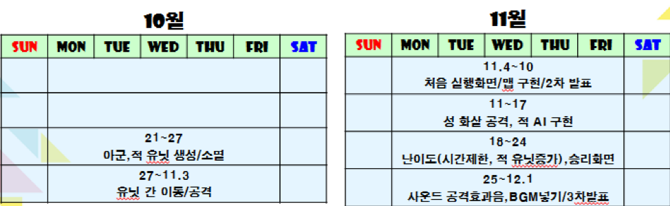

# aquaFight - C/C++/SDL

> _C_ 와 _C++_, _SDL library_ 를 이용해 윈도우 어플리케이션을 제작한 프로젝트입니다.

[](license.txt)


## 프로젝트 설명

학기말 프로젝트로 1인 개발한 게임입니다.  
범위에 따른 개발 진행을 총 기간의 1/3로 나눈 기간마다 개발 진행도를 체크해 얼마나 진행됐는지 점검했고, 최종적으로는 처음 계획 세웠던 범위의 95%를 구현했습니다.<br>
개발 하면서 느꼈던 문제점은 여러 가지가 있지만 그 중 하나는 부적절한 시간관리였습니다. 여태까지 개발 하면서 생각했던 것은 처음에 짜놓은 계획대로 가기가 힘들다는 것을 깨달았습니다.
그래서 가장 힘든 것(오래 걸리는 것)을 먼저 함으로써 그래도 95%의 완성률로 갈 수 있었고 한번에 몰아서 하는 것보다 계획이 일주일 단위라면 적절한 분배로 하는 것이 더 효율적이라는 것을 알게 되었습니다.<br>
개발하면서 스프라이트 확보하는 게 힘들었었는데 캐릭터 스프라이트를 직접 캡춰해서 하다 보니 시간이 너무 오래 걸리고 지루해 집중력도 저하되었습니다. 차라리 코딩하는게 맘 편하다는 생각을 했었습니다.



## 게임 설명
- 게임 요약: 이 게임은 여러 종류의 캐릭터들이 나와 성을 지키며 싸우는 디펜스 게임입니다. 선과 악의 대립구조로 공중 유닛과 지상 유닛으로 구성되며 유닛들은 중세부터 현대까지 다양한 유닛들이 출현합니다. 

- 게임 장르 : 액션 게임.

- 게임 방식 : 자동으로 생성되는 자원을 통해 유닛을 뽑아 싸우는 배틀 

- 게임 목표 : 상대방 타워를 파괴하면 승리.

## 구현 내용

### 구조
- GameEngine Class를 이용해 구조를 Game start - play - ending으로 나눠 개발했습니다.
<br> state 별로 update() , draw(), handleEvents() 함수가 있어 개발 및 유지보수가 용이하도록 개발했습니다.
```sh
class GameEngine
{
public:

    void init(const char* title, int width=480, int height=272, bool fullscreen=false);
    void cleanup(void);

    void changeState(GameState* state);
    void pushState(GameState* state);
    void popState(void);

    void handleEvents(void);
    void update(void);
    void draw(void);

    bool running() { return m_running; }
    void quit() { m_running = false; }

    SDL_Window *window;
    SDL_Renderer *renderer;

private:
    // the stack of states
    vector<GameState*> states;

    bool m_running;
    bool m_fullscreen;
};
```


### 구현요소 (구현율)

- 컨트롤 (85%)
<br> 키보드로 성의 화살을 움직여 각도 조절과 발사를 컨트롤, 키보드 숫자 키보드로 유닛 생성

- 유닛 (100%) 
<br> 아군 유닛 지상 4개 ,공중 4개
적 유닛 지상 4개, 공중 4개

- 맵 (100%)
<br> 맵 정적인 배경, 각 오브젝트들 구현

- 사운드 (100%)
<br> 기본 BGM 1곡, 공격 효과음 4곡, 성의 화살 효과음 1곡 

- 애니메이션 (90%)
<br> 유닛 공격/이동 상태, 성 화살 공격, 마나/체력 수치 표시

- 난이도 (100%)
<br> 시간 제한, 적 성의 HP 10%이하일때 적 유닛 증가

## 실행 방법


1. [git clone](https://github.com/jangseongwoo/aquaFight-C-SDL.git) 을 하세요.
```sh
git clone https://github.com/jangseongwoo/aquaFight-C-SDL.git
```

2. Visual studio의 프로젝트 열기로  aquaFight  _프로젝트소스_ 폴더를 열어주세요.

3. Visual studio로 프로젝트를 컴파일 및 빌드 해주시면 실행됩니다.

## 개발 환경

- 사용 OS : 윈도우7 64bit
- 개발 툴 : Visual Studio 2013

## 정보

프로젝트에 대한 더 자세한 정보를 원하신다면,  aquaFight 폴더 내에 있는 _SDL_보고서.pptx_ 를 참조해주세요.

장성우 – [@facebook](https://www.facebook.com/profile.php?id=100007028118707&ref=bookmarks) – seongwoo.dev@gmail.com

MIT 라이센스를 준수하며 ``LICENSE``에서 자세한 정보를 확인할 수 있습니다.

[https://github.com/jangseongwoo/github-link](https://github.com/jangseongwoo/github-link)

<!-- Markdown link & img dfn's -->
[npm-image]: https://img.shields.io/npm/v/datadog-metrics.svg?style=flat-square
[npm-url]: https://npmjs.org/package/datadog-metrics
[npm-downloads]: https://img.shields.io/npm/dm/datadog-metrics.svg?style=flat-square
[travis-image]: https://img.shields.io/travis/dbader/node-datadog-metrics/master.svg?style=flat-square
[travis-url]: https://travis-ci.org/dbader/node-datadog-metrics
[wiki]: https://github.com/yourname/yourproject/wiki
